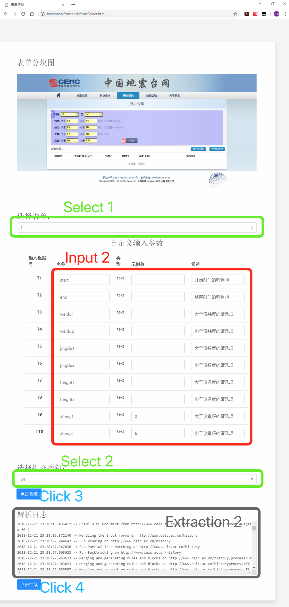
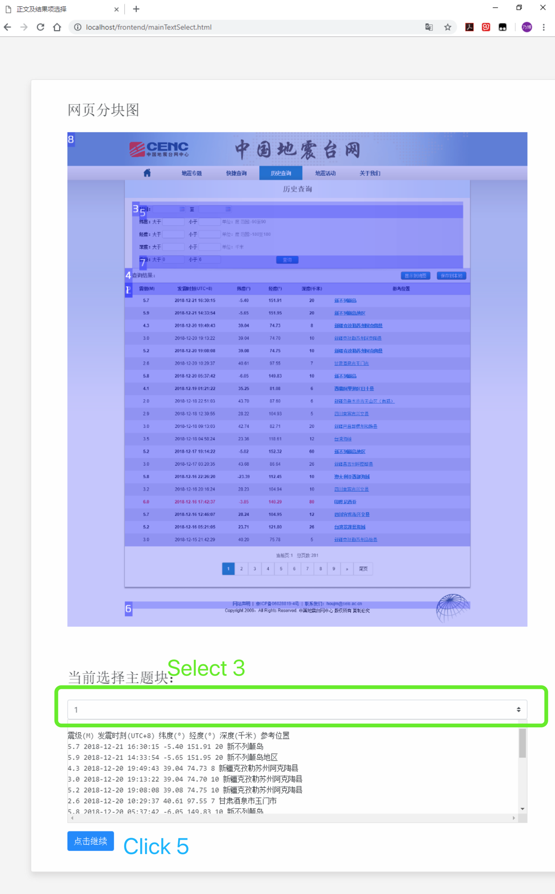
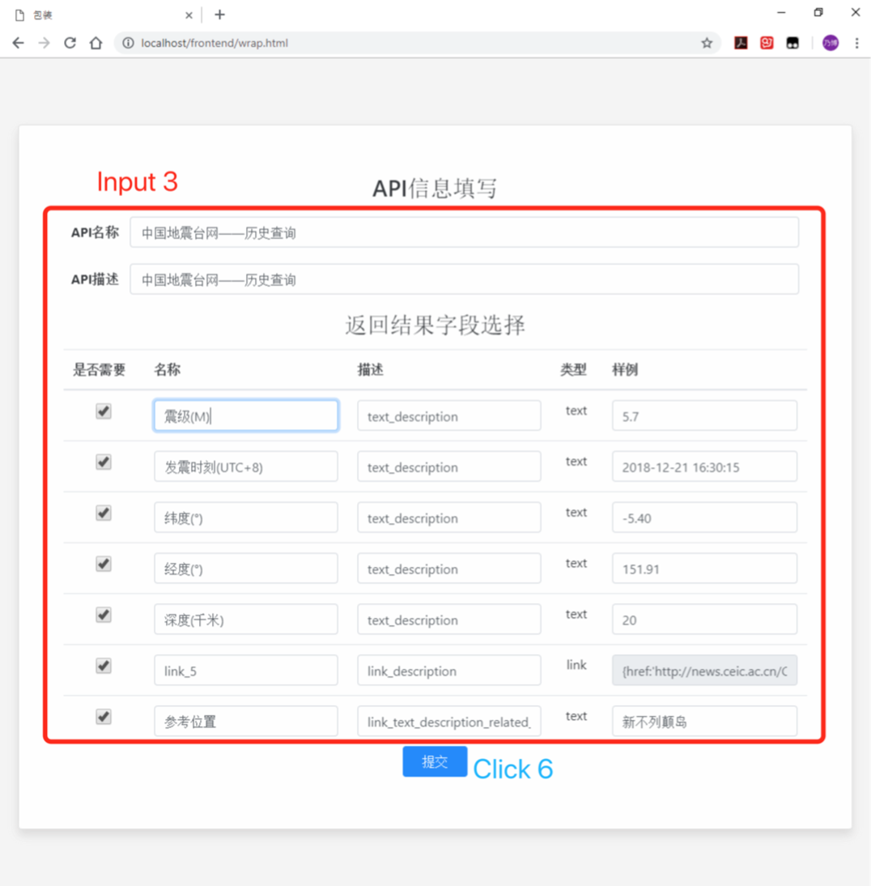
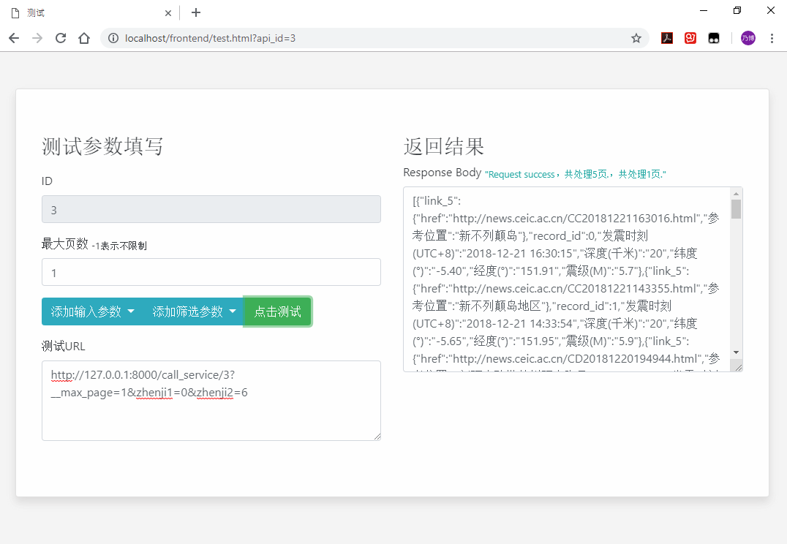

## Service Wrapper

- [中文](https://github.com/ResearcherInCS/Service-Wrapper/blob/master/README_chn.md)

## What is Service Wrapper

**Service Wrapper** is a web data extraction and packaging system based on [web page segmentation algorithm](https://github.com/liaocyintl/WebSegment). The system requires only a few clicks to get the **location description information** of the core metadata in the web page, converts the HTML document into structured data, encapsulates it as a service, and provides a **RESTFul API** that can be directly invoked.

**Service Wrapper** implements the backend functions through **Service Extraction** and **Service Invocation**, and provides a series of simple **front-end webpages** to assist users to complete the whole operation process. The **Service Extraction** is oriented to the **service wrapper**. The module uses the crawler and the web page segmentation technology to obtain the core metadata location of the webpage, and generates a webpage segmentation rule according to the location of the data in the webpage, and stores it in the database. The **Service Invocation** is oriented to the service caller, which provides description information and invocation methods of RESTFul API for each service. After the service caller making the correct invocation, the module returns structured data. At the same time, the system provides a series of front-end webpages including service extraction pages, service invocation pages and service information display pages, helping users to use conveniently.


## Technical Architecture


The system adopts the development mode of separating the front end and the back end, which can be divided into the `front end` and the `back end`.

In the front-end, the system is implemented by native `HTML, CSS, and JS` language,  while  the back-end API isimplemented  based on `flask`(Python) .

In the back-end, the system provides two operation modes : development  and production environment. In the production environment, the `Nginx + docker compose` deployment strategy is used adopted and `gunicorn` is used as the Python WSGI UNIX HTTP server.

The back-end technology stack consists of:

- `flask`
- `chrome driver`
- `selenium`
- `mongodb`
- `nginx`
- `docker-compose`
- `gunicorn`

## Configuration

- [Back-End Configuration](BackEnd/README.md)
- [Front-End Configuration](FrontEnd/README.md)

## Getting Started

You can run Service Wrapper in the public cloud, a private cloud, or install it on any OS that has `python-3.6+` installed. Service Wrapper has been tested on many flavors of` Linux`, `MacOS`, and `Windows`. 

Service Wrapper adopts a front-end separation architecture, as you can see, the folder `BackEnd` is the back-end code, while the folder `FrontEnd` is the front-end code.

We provide two different configurations for development and production environments. To get you started quickly, we will introduce each of the two configurations separately.

### clone

```git clone https://github.com/ResearcherInCS/Service-Wrapper.git```

### Development Environment

The development environment requires the OS that has ` python-3.6` or above version installed and  the [mongodb service]((https://www.mongodb.com/download-center/community)) been started.

```shell
#create a virtual environment by conda
conda create -n service-wrapper python=3.6

# Start the virtual environment
source activate service-wrapper
```

To run the back end code:

Please select the appropriate [chrome driver]((http://chromedriver.storage.googleapis.com/index.html)) according to your operating system first and place it in the folder `servicewrapper/BackEnd/app/service/driver`.

```shell
cd servicewrapper/BackEnd
# install required libraries
pip install -r requirement.txt

# WAY 1: run by python
python run.py
# WAY 2(recommended): run by gunicorn
gunicorn -w 4 -b :8000 run:app false
```

To run the front end code:

```shell
cd servicewrapper/FrontEnd

# run by http-server
http-server --cors  ./ index.html  # index.html is the start page

```

#### Production Environment

You can run Service Wrapper in the OS that has Docker 1.11+ and Docker compose installed.

```shell
cd servicewrapper/BackEnd/docker

sudo docker-compose build
sudo docker-compose up -d
```

Because the production environment is driven by **docker** and uses **nginx** as a WEB resource server and a reverse proxy server, You have to place the front-end code in the location specified by `servicewrapper/BackEnd/docker/nginx.conf`.

## Manual

Service Wrapper is suitable for web pages with clear structure and the layout of core metadata that is roughly consistent with the web page.

Service Wrapper divides the encapsulated webpage into `static webpages` and `dynamic webpages`, the static webpages contain the information which is directly showed in the pages when they are opened, such as the table content showing in the page: [China Earthquake Website-Quick Query](http://www.ceic.ac.cn/speedsearch?time=7); the dynamic webpages are pages whose information is not directly showed in the page, so we should first fill the query forms with some filtering conditions and then get the data generated from the website, since the data is related to our query conditions, so we called these kinds of pages 'dynamic webpages'. Here is a case, you should first fill in the query form with specific conditions and click the query botton, then you can get the dynamic data generated in the table section: [China Earthquake - Historical Query](http://www.ceic.ac.cn/history).

There are differences in the wrapping steps of the two web pages. The dynamic webpage has one more filtering condition step than the static webpage, so the following example will show how to use the system through a dynamic webpage.

- Step 1: Open the first page—Page Analysis, input the` url of the page to be encapsulated` in `Input 1`, and click `Click 1`. In the Extraction Log window, you can see` Extraction Log 1`. When the button `Click 2` appears, you can click it and go to the next page -- Form Selection.


- Step 2: In the page--Form Selection, select the corresponding form number in `Select 1` according to the "form block diagram", and the "input parameters" on the lower side will change accordingly. Enter or change the parameter name, input sample value and description information in `Input 2`; select the submit button in `Select 2`. (Note that the input sample value entered in Input 2, the system background will automatically fill it into the corresponding area, and click the button selected in Select 2 to get the data.) Click `Click 3` to extract the service from the web page. You can see the parsing log in `Extraction 2`. When the `Click 4` button appears, click it to go to the next page - Text and Result Item Selection.



- Step 3: In the page--Text and Result Item Selection,  select the corresponding form number  in `Select 3` according to the "page block diagram" , and the text information on the lower side is changed accordingly.  Once the selection is complete, click `Click 5` to go to the next page -- Packaging.



- Step 4: In the page--Packaging, we can see the basic information of the API and the default information of the extracted data in `Input 3`, which can be modified according to the actual situation. After the modification is complete, click `Click 6` to finish the service packaging work. Next, you will be taken to the service call page -- Test.



- Step 5: After the service extraction completed, the service wrapper needs to pass the test to see whether the result and  the parameters of the service extraction are correct. In the page--Test, The parameter `Maximum Pages`  is a hyperparameter, independent of the service, indicating how many pages of data will be fetched. The default value is 5. `Input parameters` are the parameters filled in step 2, which means that the data will be queried with these parameters as the condition; `screening parameters` are the parameters filled in step 4, which means that all the acquired data will be filtered according to the parameters here, only returns data that satisfies the condition of these parameters.



Static webpage and dynamic webpage operation steps are basically the same, but the lack of step 2, that is, the steps of static webpage are composed of the step 1, step 3, step 4 and step 5 above.
